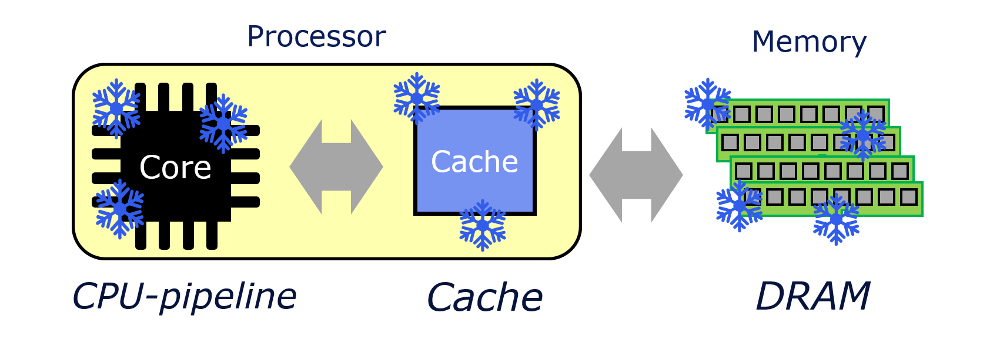

# CryoModel


CryoModel is **the cryogenic DRAM, cache, and CPU-pipeline performance modeling framework**.
CryoModel predicts the performance and power of DRAM, cache, and CPU-pipeline running at the extremely low temperature (e.g., 77K).
CryoModel is developed by **[HPCS lab](https://hpcs.snu.ac.kr)** in Seoul National University (*SNU*).

CryoModel consists of the following three models: *Cryo-MOSFET*, *Cryo-MEM*, and *Cryo-Pipeline*.
Please refer to our CryoRAM [\[1\]](#markdown-header-publications), CryoCache [\[2\]](#markdown-header-publications), and CryoCore [\[3\]](#markdown-header-publications) papers for more details of our modeling methodology.

#### Current version

The release of CryoModel is in progress; we are conducting further validation to reliably model the future (smaller) technology nodes. 
We summarize the coverage of current version as follows. 
The updated version will be released soon.

* Cryo-MOSFET's MOSFET model is the version proposed in [\[1\]](#markdown-header-publications),[\[2\]](#markdown-header-publications), which does not include the model extension proposed in [\[3\]](#markdown-header-publications).
* Cryo-MEM assumes wire resistivity's temperature dependency follows that of the bulk wire. 
* Cryo-Pipeline is currently being prepared for the release. 

#### Pre-requirements

 * Python 3.8
 * Protobuf (pip install protobuf)


## Cryo-MOSFET

Cryo-MOSFET predicts MOSFET (i.e., Ion, Ioff) and wire characteristics (i.e., wire resistivity) at low temperatures.

#### Command:
```
python3.8 ./pgen.py -mm {mosfet_mode} -t {temperature} -n {node} -d {vdd} -r {vth} -wm {wire_mode} ...
```

#### Options:
* mosfet_mode: type of target transistor
	* 1: HP (High-performance) transistor
 	* 2: DRAM access transistor
* temperature: target operating temperature (77K-300K) [K]
* node: transistor technology node [nm]
* vdd: supply voltage [V]
* vth: threshold voltage at 300K (i.e., Vth0_300K) [V]
* wire_mode: type of wire resistivity model
	* 1: bulk wire resistivity model
	* 2: narrow wire resistivity model (need wire width and height)

#### output:
 * Ion: on-channel current per 1um of gate width [A/um]
 * Isub: subthreshold leakage current per 1um of gate width [A/um]
 * Igate: gate tunneling current per 1um of gate width [A/um]
 * Rwire: wire resistivity [Ω * nm]

#### example:
```
cd cryomosfet
python3.8 ./pgen.py -mm 1 -t 77 -n 22 -d 0.8 -r 0.5 -wm 1
```


## Cryo-MEM

Cryo-MEM generates a target temperature-optimal memory design (i.e., DRAM, cache) and reports its area, latency, and power consumption, based on the MOSFET and wire characteristics obtained from the Cryo-MOSFET.
We highly recommend users to use the relative performance values (e.g., 77K SRAM is 2 times faster than 300K SRAM), not the absolute numbers (e.g., 2ns of access latency of 77K SRAM) for their research.

#### Command:
```
python3.8 ./run.py {cacti_config_file} {temperature} {node} {vdd} {vth} {capacity} {memory-type} ...
```

#### Options:
* cacti_config_file: memory config file (~.cfg) for cacti
* temperature: Target operating temperature (77K-300K) [K]
* node: transistor technology node [nm] (NOTE: input node should match the "-technology" of the input config file)
* vdd: Supply voltage [V]
* vth: Threshold voltage at 300K (i.e., Vth0_300K) [V]
* capacity: Size of cache and memory [Bytes]
* cell-type: Memory cell types
	* dram: DRAM memory (need vdd and vth of access transistors (i.e., acc_vdd, acc_vth))
	* cache: cache memory (i.e., SRAM, 3T-eDRAM)

#### Output:
* optimal memory design (e.g., Ndwl, Ndbl, Ndcm, ...)
* access latency (e.g., tRCD, tRAS, tCAS, ...)
* power consumption (e.g., Read/write energy per access, leakage power)
* area occupancy (e.g., memory cell area, total area)

#### Example:
1. Compile cacti
	:
	
		cd CryoMEM/cacti
		make
	

2. Run SRAM cache
	:

		cd CryoMEM
		python3.8 run.py configs/cache-sram.cfg 77 22 1 0.4 8192 cache

3. Run 3T-eDRAM cache
	:

		cd CryoMEM
		python3.8 run.py configs/cache-3tedram.cfg 77 22 1 0.4 8192 cache

4. Run DRAM memory
	:

		cd CryoMEM
		python3.8 run.py ./configs/DRAM.cfg 77 22 1.2 0.4 262144 dram 1.2 0.4


## Contributors

 * [Dongmoon Min](https://hpcs.snu.ac.kr/~dongmoon/)
 * [Ilkwon Byun](https://hpcs.snu.ac.kr/~ilkwon/)
 * [Gyuhyeon Lee](https://hpcs.snu.ac.kr/~guhylee/)
 * [Jangwoo Kim](https://hpcs.snu.ac.kr/~jangwoo/)


## Publications

If you use this modeling framework for your research, please cite the papers below.

[\[1\]](#markdown-header-publications) [G.-h. Lee, D. Min, I. Byun, and J. Kim, “Cryogenic computer architecture modeling with memory-side case studies,” in *Proceedings of the 46th International Symposium on Computer Architecture (ISCA’19).*](https://dl.acm.org/doi/abs/10.1145/3307650.3322219)

[\[2\]](#markdown-header-publications) [Min, D., Byun, I., Lee, G. H., Na, S., & Kim, J. "CryoCache: A Fast, Large, and Cost-Effective Cache Architecture for Cryogenic Computing." *Proceedings of the Twenty-Fifth International Conference on Architectural Support for Programming Languages and Operating Systems (ASPLOS'20).*](https://dl.acm.org/doi/abs/10.1145/3373376.3378513)

[\[3\]](#markdown-header-publications) [Byun, I., Min, D., Lee, G. H., Na, S., & Kim, J. "CryoCore: A Fast and Dense Processor Architecture for Cryogenic Computing." *Proceedings of the 47th International Symposium on Computer Architecture (ISCA'20).*](https://ieeexplore.ieee.org/abstract/document/9138996)
